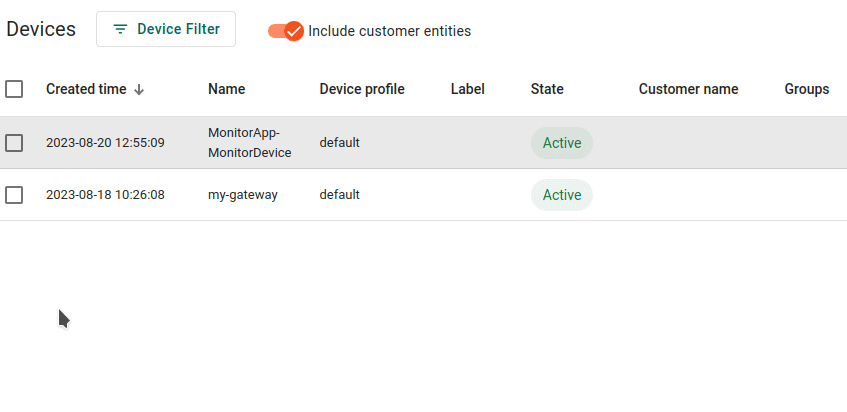

# Thingboard Smart Gateway

Ideas, considerations and POCs for a **custom *Thingsboard Gateway* implementation** as a distributed event driven
application based on Redis, Spring Boot 3 and Apache Camel 4.

## Description

We will show how easily we can implement a custom Thingsboard Gateway application, connecting Hl7v2 messages to
Thingsboard, while having a solution open for future additional complexities.


It will be comprised of 4 running services: a `Redis` instance and 2 spring boot services: `redisx-mqtt-bridge`,
a `hl7-connector` and a `video-connector`.

## Motivation

You can read about the motivation for a *Custom Thingsboard Gateway Implementation based on
Redis* [here](./Motivation.md).

## Features

* Thingsboard Gateway integration.
* Spring Boot 3 and Apache Camel 4 project configurations.
* Spring Boot 3 Starter development.
* Apache Camel HL7v2 camel integration.
* Spring Data Redis reactive streams.
* HiveMQ reactive java MQTT client.
* Apache Camel 4 component development: Video Input Output Component.
* Deep Java Library (DJL) integration. Yolo 5 detection.

## Modules Description

* [redisx-mqtt-bridge](./redisx-mqtt-bridge): A *service* which connects redis streams and MQTT topics, allowing the
  seamless transmission of bytes through reactive APIs. It allows us to create
  a `ThingsBoard Redis Streams Gateway API`.
* [hl7-connector](./hl7-connector): A Thingsboard Smart Gateway sample connector *service* for HL7v2 messages based on
  Spring Boot 3 and Apache Camel 4.
* [thingsboard-smartgw-connector-base](./thingsboard-smartgw-connector-base): A base *library* in order to implement a
  Thingsboard Smart Gateway java connector. Basically,
  a `ThingsBoard Redis Streams Gateway API` [publisher](./thingsboard-smartgw-connector-base/src/main/java/es/omarall/thingsboard/smartgw/connector/base/TbSmartGatewayPublisher.java)
  and some message converter contracts.
* [thingsboard-smartgw-connector-starter](./thingsboard-smartgw-connector-starter): the Spring Boot starter *library*
  for the previously described library so a `Thingsboard Smart Gateway Java Connector` may automatically have
  a `ThingsBoard Redis Streams Gateway API` [publisher](./thingsboard-smartgw-connector-base/src/main/java/es/omarall/thingsboard/smartgw/connector/base/TbSmartGatewayPublisher.java)
  instantiated and configured.
* [environment](./environment):
* [video-connector](./video-connector): A Thingsboard Smart Gateway sample connector *service* for video input and
  output based on Spring Boot 3 and Apache Camel 4.
* [camel-video-io](./camel-video-io): An Apache Camel component for video input and output based on javacv library.

## HL7 Scenario

Let's suppose a vital signs monitor device that monitors a patient's vital signs, like breath rate, heart rate and body
temperature, by sending HL7v2 ORU-R01 messages to a health information system.
The **ORU-R01** (Unsolicited observation result) message in HL7 is used to transmit observations and results, which
could include vital signs information, laboratory test results, radiology reports, etc.

The following is an example of an ORU-R01 message:

```text
MSH|^~\&|MonitorDevice|MonitorApp|Hospital|HIS|20230801||ORU^R01|MSG00001|P|2.3|
PID|1|123456|78901234||Doe^John^^Mr.||19900101|M|||123 Main St.^^City^ST^12345||||S|MRN123456789|1234567890|
OBR|1|123456|78901234|Vital Signs^Monitor|||20230801103000|||123^Smith^John^Dr.^^^|||||||||||ADM1234567890|20230801103000|
OBX|1|NM|9279-1^Respiratory rate^LN||20|/min||A|||F|||20230801103000|
OBX|2|NM|8867-4^Heart rate^LN||80|bpm|||||F|||20230801103000|
OBX|3|NM|8310-5^Body temperature^LN||37.0|Cel|||||F|||20230801103000|
OBX|4|NM|9279-1^Respiratory rate^LN||22|/min|||||F|||20230801103500|
OBX|5|NM|8867-4^Heart rate^LN||85|bpm|||||F|||20230801103500|
OBX|6|NM|8310-5^Body temperature^LN||37.1|Cel|||||F|||20230801103500|
```

## Prerequisites

* Docker and docker compose installed on your machine
* Java 17+
* Maven 3+ installed
* A running Thingsboard server or a [Thingsboard Cloud account](https://thingsboard.cloud/) account.
* A `Gateway device` created in Thingsboard and the device access token copied.

## Getting Started

Let s start cloning the project and deploying the redis instance:

```bash
$ git clone https://github.com/oalles/thingsboard-smartgw
$ mvn clean install -DskipTests
$ cd thingsboard-smartgw/environment
# Deploy Redis 
$ docker-compose up 
```

### redisx-mqtt-bridge

Given the following configuration file:

```yaml[redisx-mqtt-bridge/src/main/resources/application.yml] 
mqtt:
  host: thingsboard.cloud # broker.hivemq.com
  username: O5iuAs0O1MVFH23lbmL0 # The TB Gateway device access token
#  password:

application:
  bridge-definitions:
    - name: telemetry 
      direction: REDIS_TO_MQTT
      streamKey: telemetry # Send telemetry here
      topic: v1/gateway/telemetry
    - name: attributes # 
      direction: REDIS_TO_MQTT
      streamKey: attributes # client attribute updates
      topic: v1/gateway/attributes
    - name: attributes updates
      direction: MQTT_TO_REDIS
      streamKey: attribute.updates # shared attribute updates on attribute.updates stream
      topic: v1/gateway/attributes
```

[redisx-mqtt-bridge](./redisx-mqtt-bridge) allows us to convert
the [Thingsboard Mqtt Gateway api](https://thingsboard.io/docs/reference/gateway-mqtt-api/) into a *ThingsBoard Redis
Gateway API*.

Run the [redisx-mqtt-bridge](./redisx-mqtt-bridge) service.

```bash
$ cd redisx-mqtt-bridge
$ mvn spring-boot:run
```

### hl7-connector

The `HL7 Thingsboard Gateway Connector` is a Spring Boot 3 and Apache Camel 4 project, that will process ORU-R01
messages, generating telemetry and client attribute updates.

Given the following configuration file HL7 Connector
in [application.yml](./hl7-connector/src/main/resources/application.yml).

```yaml[hl7-connector/src/main/resources/application.yml]
# This is the endpoint of incoming requests - HL7 Server.
hl7-server:
  hostname: localhost
  port: 8888

# Utility Route - HL7v2 message producer from file definitions
file-producer:
  enabled: true # Enables a utility route
  input-dir: /tmp/hl7 # Drop HLv2 messages into this folder for testing and development
  delay-in-seconds: 5
```

we are providing a HL7 Server endpoint and a utility route that will read HL7v2 messages from a folder and send them to
the HL7 Server endpoint.

Run the [hl7-connector](./hl7-connector) service.

```bash
$ cd hl7-connector
$ mvn spring-boot:run
```

### Usage

You will find ORU-R01 sample message in [resources folder](./hl7-connector/src/main/resources/oru-r01.txt).

```text
MSH|^~\&|MonitorDevice|MonitorApp|Hospital|HIS|20230801||ORU^R01|MSG00001|P|2.3|
PID|1|123456|78901234||Doe^John^^Mr.||19900101|M|||123 Main St.^^City^ST^12345||||S|MRN123456789|1234567890|
OBR|1|123456|78901234|Vital Signs^Monitor|||20230801103000|||123^Smith^John^Dr.^^^|||||||||||ADM1234567890|20230801103000|
OBX|1|NM|9279-1^Respiratory rate^LN||20|/min||A|||F|||20230801103000|
OBX|2|NM|8867-4^Heart rate^LN||80|bpm|||||F|||20230801103000|
OBX|3|NM|8310-5^Body temperature^LN||37.0|Cel|||||F|||20230801103000|
OBX|4|NM|9279-1^Respiratory rate^LN||22|/min|||||F|||20230801103500|
OBX|5|NM|8867-4^Heart rate^LN||85|bpm|||||F|||20230801103500|
OBX|6|NM|8310-5^Body temperature^LN||37.1|Cel|||||F|||20230801103500|
```

Just drop it in `file-producer.input-dir` location. The connector will automatically process the HL7 message and extract
telemetry and client attributes updates.
Check the Thingsboard console to verify data transmission. A device named `MonitorApp-MonitorDevice` will be created and
telemetry and attributes will be updated accordingly.



## UPDATE: Video Scenario

One common concern when considering Apache Camel for integration is the availability of specific clients or connectors.
Some might wonder if Apache Camel remains a viable choice when their
desired [component](https://camel.apache.org/components/4.0.x/index.html) isn't readily available.

We 'll explore a hypothetical situation: We need to add a video connector to our gateway to connect to a video source,
perform person and car detections on each frame, and transmit the results to Thingsboard.
All be built on top of Apache Camel.

To achieve this, we create two components:

* [Video-IO](./camel-video-io) Camel Component: This component facilitates video input and output for Apache Camel.
* [Video-Connector](./video-connector) for the Gateway: Implemented as a Camel route, this component leverages Yolo V5
  detections to process video data , relaying the information to Thingsboard.

